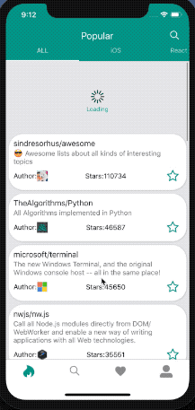

# Github Mobile Client

Have you ever thought to check Github Trending and Popular Reposiroties with your phones? 🧐 This mobile app can give you a hand! 😎

<div align="center">
  
</div>

## Features

- 💻 Check Popular Repositories on specific programming language.
- ✌ Support 30+ language
- 🔨 Custom Theme.
- 🔬 Search you want.
- 💟 Subscribe your favorite repositories.
- 🔥 Hot Update in CodePush
- 📥 Offline Cache and Cache Management

## Installation

```sh
# Install Dependencies
$ npm run i

# If you want to run iOS simulator
$ react-native run-ios

# If you want to run Android simulator
$ react-native run-android
```